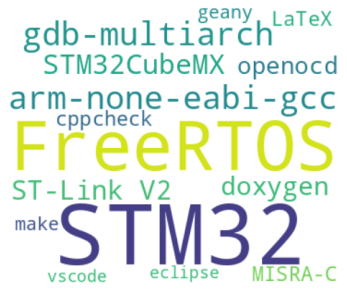

# Les matériels pour le développement 

## Au bureau, un PC

Au bureau un PC permet de faire le développement,
son système d'exploitation est Debian/Linux.

## À bord du navire

À bord du navire l'énergie disponible est très réduite,
un raspberry pi 3B+ permet quelques modifications de code.
Il pilote aussi la sonde de la carte Nucleo.
Son système d'exploitation est raspbian, c'est une distribution
debian/Linux adaptée au raspberry.

# Les outils de développement

Le PC et le raspberry ont les mêmes outils de production de code et de documentation.
Par contre les IDE sont différents.

## Liste des outils
Le compilateur est celui du GNU.
Il produit un code performant et
est très bien documenté et supporté par une importante communauté.
ST Microelectronics fournit des cartes Nucleo pour le prototypage
équipées d'une sonde ST Link V2 pilotée par openocd.

| Nom                   | Version       | Remarque                   |
|-----------------------|---------------|----------------------------|
| STM32CubeMX           | Dernière version | Outil de ST Microelectronics |
| GNU arm-none-eabi-gcc | 12 recommandé | compilateur croisé         |
| make                  | 4 ou plus     | Gestion de la production de code |
| openocd               | 0.10 ou plus récent | pilote de la sonde |
| gdb-multiarch | 13 ou plus |  Débogueur |
| ddd                   | 3.3 min       | Interface très légère pout gdb |
| cppcheck | 2 min | Vérification de code |
| LaTeX                 | nimporte | Production de la doc |
| latexmk               | récent | Équivalent à make pour LaTeX |
| vscode                | version récente | IDE Microsoft |
| geany                 | version récente | IDE très léger |
| eclipse               | version récente | IDE libre |


vscode et eclipse exigent beaucoup trop de mémoire et
ne peuvent être exécutés sur le raspberry pi 3B+.
À la place geany et ddd permettent d'éditer et deboguer le code.

## Installation 

L'installation des outils se fait principalement avec ```apt install```

```apt install gcc-arm-none-eabi binutils-gcc-arm-none-eabi gdb-multiarch make openocd geany```
```apt install latex latexmk```

eclipse est vscode sont à télécharger sur les sites de eclipse.org et Microsoft.

## Production

Le Makefile est à la racine du projet. Il est renommé Makefile.user
pour ne pas être écrasé par STM32CubeMx. 


